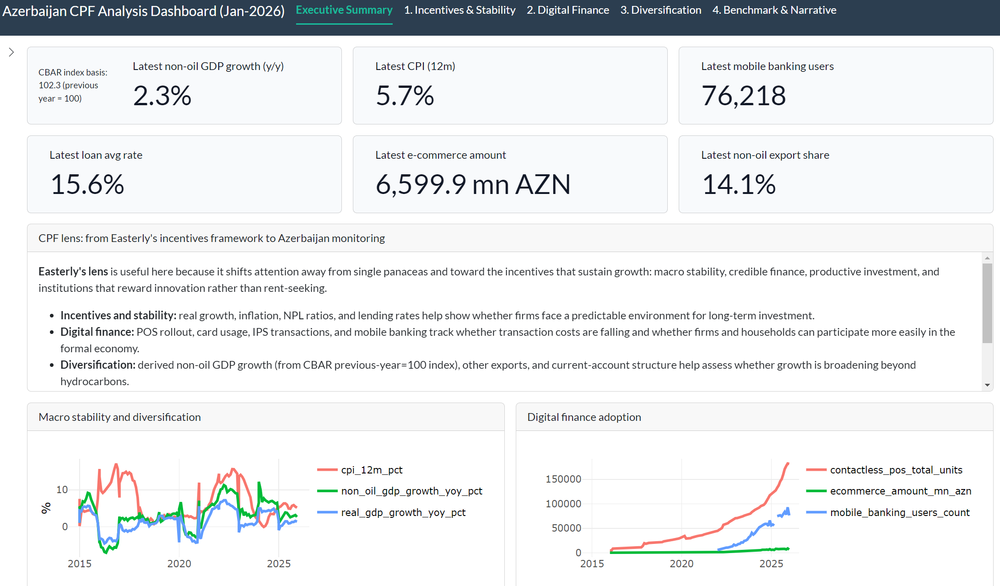
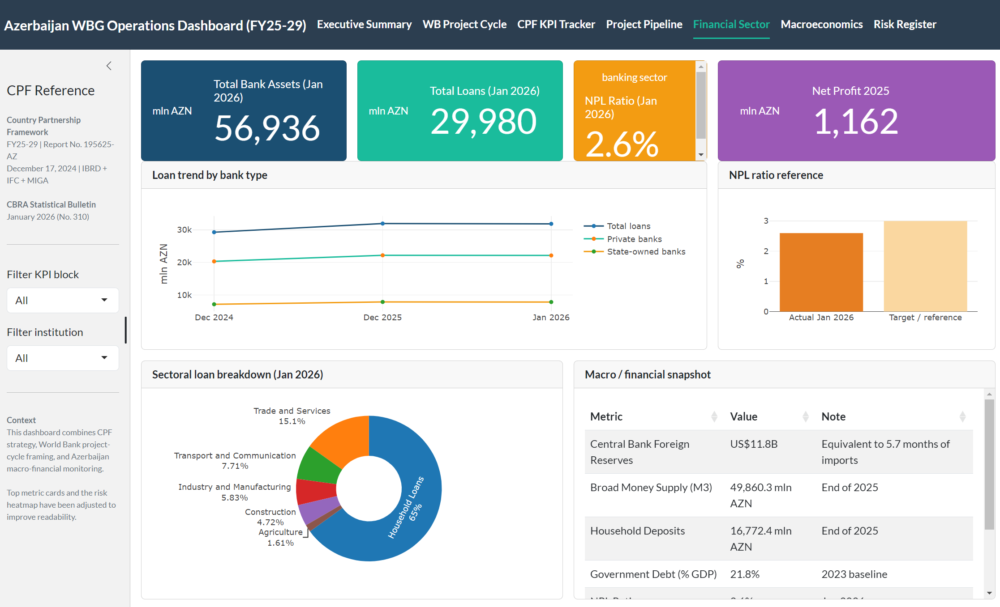

# World Bank Development Statistics Pipeline and Azerbaijan CPF Analysis

This project implements a layered analytical data warehouse (Bronze / Silver / Gold) for public development indicators, governance, financial access, trade statistics, climate-related external data, price-level proxies, and Azerbaijan-focused macro-financial monitoring, with validation, BigQuery loading, and analysis-ready outputs.

---

## Quick navigation

**Dashboards and analytical design**
- [Azerbaijan CPF dashboard: analytical design rationale](#azerbaijan-cpf-dashboard-analytical-design-rationale)
- [World Bank-style project cycle context](#world-bank-style-project-cycle-context)

**Statistical analysis**
- [Azerbaijan financial sector analysis notebook](#azerbaijan-financial-sector-analysis-notebook)

**Azerbaijan data layer**
- [Azerbaijan central bank and official-statistics layer](#azerbaijan-central-bank-and-official-statistics-layer)
- [Azerbaijan analytical themes: three Gold marts](#azerbaijan-analytical-themes-three-gold-marts)
- [Official source URLs](#official-source-urls)
- [Azerbaijan source-to-table mapping](#azerbaijan-source-to-table-mapping)

**Repository reference**
- [Why this repository](#why-this-repository)
- [BigQuery datasets](#bigquery-datasets)
- [Current implemented pipelines](#current-implemented-pipelines)
- [Pipeline details](#pipeline-details)
- [Validation vs testing](#validation-vs-testing)
- [Raw data landing](#raw-data-landing)
- [Repository structure](#repository-structure)
- [Suggested analytical use cases](#suggested-analytical-use-cases)
- [Current limitations](#current-limitations)

---

## Overview

This repository builds development-data pipelines that:

- extract public international data from source-oriented datasets, bulk files, APIs, web scraping, XML feeds, and official web publications
  (e.g., [Central Bank of the Republic of Azerbaijan](https://www.cbar.az/home?language=en), [UNICEF](https://data.unicef.org/resources/un-inter-agency-group-for-child-mortality-estimation-unigme/), [IMF](https://www.imf.org/en/home), [UN Comtrade](https://comtradeplus.un.org/))
- transform raw inputs into curated analytical tables using **Bronze / Silver / Gold** architecture
- validate structural and data-quality conditions
- load outputs into BigQuery
- support downstream cross-country, city-level, and country-specific analysis
- support [Azerbaijan CPF](https://openknowledge.worldbank.org/entities/publication/a7c9d0a2-ef37-4089-872a-4c66d5659516)-focused analytical and simplified banking decision-support demos

---

## Azerbaijan CPF dashboard: analytical design rationale

The Azerbaijan CPF dashboard components were designed around the
[Azerbaijan Country Partnership Framework FY25-29](https://openknowledge.worldbank.org/bitstreams/99f07530-002f-440e-b864-69a1a0133625/download)
(Report No. 195625-AZ, December 2024, IBRD / IFC / MIGA), which identifies two High-Level Outcomes:

- **HLO 1 — Increased Resilience & Sustainability**: energy transition, climate adaptation, water access, irrigation, desalination
- **HLO 2 — Increased Productivity & Better Jobs**: private sector development, MSME finance, jobs, transport, digital connectivity

The indicator selection was partly informed by [William Easterly's The Elusive Quest for Growth](https://en.wikipedia.org/wiki/The_Elusive_Quest_for_Growth), particularly its focus on incentives, macroeconomic stability, and institutions as foundations for durable growth — consistent with Azerbaijan's oil-dependent structural context.

### How the pipeline connects to the CPF diagnostic themes

Each CPF diagnostic theme maps directly to one or more BigQuery analytical layers in this repository:

| CPF diagnostic theme | BigQuery tables |
|---|---|
| Oil dependency and diversification | `aze_economic_diversification_periodic`, `trade_country_year_long` (HS 2709 / 2711 vs non-oil exports) |
| Financial sector vulnerability | `aze_credit_access_and_stability_periodic` (NPL structure, interest rates, MSME loan balance, movable collateral registry) |
| Digital finance and inclusion | `aze_digital_finance_periodic` (POS / ATM density, mobile banking adoption, card transaction volume) |
| Macroeconomic stability | `aze_fx_monthly`, `aze_macro_monthly`, `aze_policy_rate_monthly` |
| Governance and institutions | `wgi_country_year` (WB Worldwide Governance Indicators, six dimensions) |
| Human capital | `lays_country_year`, `girls_primary_completion_country_year` |
| External sector and trade | `aze_balance_of_payments_periodic`, `aze_foreign_trade_periodic`, `trade_country_year_long` |

### How to use this for a World Bank CPF-style discussion

1. **Macro incentives:** show whether inflation, lending rates, and NPL dynamics create or weaken incentives for long-term private investment.
2. **Digital inclusion:** show whether payment rails, POS density, e-commerce, and mobile banking are lowering friction for households and MSMEs.
3. **Structural transformation:** compare non-oil GDP growth and non-oil export trends with oil-linked external balances.
4. **Institutional cross-check:** benchmark Azerbaijan against GDP, governance, and financial inclusion indicators where World Bank-managed datasets are available.

### Dashboards

These two dashboards reflect different stages of the architecture:

- The **[CPF Analysis dashboard](https://mtk01.shinyapps.io/azerbaijan-cpf-dashboard/)** reads directly from the pipeline output CSVs (`aze_credit_access_and_stability_periodic.csv`, `aze_digital_finance_periodic.csv`, `aze_economic_diversification_periodic.csv`) produced by the Python ETL scripts in this repository. This dashboard is already connected to the pipeline: updating the source data and re-running the pipeline automatically updates what the dashboard displays.

<p align="center">
  
</p>

- The **[CPF Project-Cycle dashboard](https://mtk01.shinyapps.io/azerbaijan-project-cycle-dashboard/)** uses manually curated snapshots from the CBAR Statistical Bulletin (January 2026, No. 310) and the CPF document, focused on WB project-cycle framing and KPI tracking.

<p align="center">
  
</p>

The next step is to connect both dashboards to read live from the BigQuery Gold marts rather than from local CSV files.

---

## World Bank-style project cycle context

| Stage | Relevance to this repository |
|---|---|
| Identification | Supports CPF-style diagnostics and baseline indicator framing |
| Preparation | Builds validated analytical tables from public-source data |
| Appraisal | Supports evidence packs, benchmarking, and monitoring logic |
| Negotiation / Approval | Provides structured analytical inputs for documentation |
| Implementation | Feeds dashboards and periodic monitoring views |
| Completion / Validation & Evaluation | Supports retrospective indicator-based assessment |

---

## Azerbaijan financial sector analysis notebook

`analysis/wb_aze_cpf_full_analysis.ipynb` is an end-to-end quantitative analysis of Azerbaijan's financial sector, combining macroeconomic KPI design, econometric modelling, machine learning, and cross-country benchmarking. It consumes the Gold-layer CSV outputs produced by the ETL pipeline in this repository.

### Data inputs

| File | Source table | Description |
|---|---|---|
| `aze_banking_monthly.csv` | `aze_banking_monthly` | Monthly bank balance sheet: total assets, loans, deposits (74 months) |
| `aze_interest_rates_periodic.csv` | `aze_interest_rates_periodic` | AZN and FX lending / deposit rates |
| `aze_policy_rate_monthly.csv` | `aze_policy_rate_monthly` | CBAR refinancing rate and interest rate corridor |
| `aze_npl_structure_periodic.csv` | `aze_npl_structure_periodic` | Non-performing loan stock by category |
| `aze_macro_main_periodic.csv` | `aze_macro_main_periodic` | Annual macro indicators: GDP, non-oil GDP, CPI |
| `global_findex_country_year.csv` | `global_findex_country_year` | World Bank Global Findex: financial inclusion indicators, 160+ countries |
| `gdp_per_capita_country_year.csv` | `gdp_per_capita_country_year` | World Bank API: GDP per capita, 160+ countries |

### Analysis structure

| Section | Technique | Purpose |
|---|---|---|
| 1 | Data loading and feature engineering | LDR, NPL ratio, interest spread, mobile penetration |
| 2 | KPI design and dashboard | 9-panel banking sector KPI dashboard |
| 3 | Correlation heatmap | Multicollinearity detection before modelling |
| 4 | ADF unit root tests | Stationarity check for all candidate regressors |
| 5 | OLS regression | Drivers of AZN lending rates |
| 6 | Ridge / Lasso / Elastic Net | Regularisation and variable selection |
| 7 | Granger causality test | Monetary policy transmission: policy rate → lending rate |
| 8 | ARIMA forecasting | 12-month forecast of bank loan stock |
| 9 | Random Forest | Non-linear prediction of month-on-month loan growth |
| 10 | Panel data regression | Financial inclusion and GDP per capita, 160 countries |
| 11 | K-Means clustering + PCA | Country financial inclusion profiles |
| 12 | Bootstrap confidence interval | Distribution-free CI for mean LDR |
| 13 | Chow structural break test | Impact of the 2015 AZN currency crisis |
| 14 | KPI scorecard | Traffic-light summary of current sector status |
| 15 | Summary of findings | Key results across all methods |

### Key findings

| Analysis | Finding |
|---|---|
| **OLS (R² = 0.87)** | Deposit rate (β ≈ +0.74\*\*\*) and LDR (β ≈ +0.03\*\*\*) are the primary drivers of lending rates. The policy rate loses significance once deposit rates are controlled for. |
| **Durbin-Watson ≈ 0.88** | Strong positive serial autocorrelation — production code should use Newey-West standard errors. |
| **Granger causality** | Policy rate Granger-causes lending rate at lags 1–4 (F = 10.3, 4.4, 2.9, 3.0; all p < 0.05), suggesting a 1–4 month monetary transmission lag. |
| **ARIMA(3,1,3)** | 12-month hold-out RMSE = 241 mn AZN (MAPE ≈ 0.7%) — strong short-term predictability of the aggregate credit stock. |
| **Random Forest** | Weak predictive power for month-on-month loan growth (hold-out R² ≈ −0.84); short-run fluctuations are noisy with the current feature set. |
| **Panel FE** | A 1% rise in GDP per capita is associated with +0.23 ppt higher account ownership within a country (pooled OLS: +0.16 ppt). |
| **K-Means (K = 2)** | Optimal K = 2 (silhouette = 0.54); Azerbaijan falls in the developing-access cluster alongside other upper-middle income transition economies. |
| **Bootstrap CI (LDR)** | Mean LDR = 69.5%, 95% CI [68.1%, 70.8%]; latest reading (81.5%) breaches the prudential threshold. |
| **Chow test** | Structural break confirmed at 2015 (F = 89.7, p < 0.001); post-crisis monetary transmission is noticeably weaker. |

### Methodology notes

- All level-series regressions were preceded by ADF unit-root tests; non-stationary series were first-differenced before Granger testing.
- TimeSeriesSplit cross-validation was used throughout to prevent look-ahead bias in all ML and regularisation steps.
- Ridge / Lasso regularisation paths confirm the deposit rate as the dominant, stable predictor across all regularisation levels.

*Data: CBAR Statistical Bulletin, World Bank Global Findex, World Bank API. Tools: Python (statsmodels, scikit-learn, matplotlib, seaborn).*

---

## Azerbaijan central bank and official-statistics layer

The Azerbaijan-focused component is intentionally positioned as the **first country-specific layer** in this repository because it demonstrates an end-to-end **Bronze / Silver / Gold** architecture built from official public sources.

This layer combines:
- CBAR FX data
- SSC monthly macro pages
- CBAR Statistical Bulletin workbook tables
- CBAR policy corridor / refinancing-rate information
- integrated Gold marts for macro-financial and development-oriented interpretation

It is designed as both a data-engineering example and an analytical foundation for:
- CPF-style country interpretation
- digital-finance progress monitoring
- credit-access and MSME finance analysis
- financial-stability analysis
- external-sector and diversification monitoring
- simplified banking decision-support demos

### Data engineering design

#### Bronze
Source-faithful raw landing tables.

Current Azerbaijan Bronze inputs include:
- CBAR FX daily raw snapshots from the public XML feed
- SSC monthly macro pages parsed from public HTML pages
- CBAR Statistical Bulletin workbooks manually landed in raw folders and parsed into raw bulletin tables
- policy-rate event raw tables from CBAR policy publications

#### Silver
Cleaned and standardized analytical tables at monthly or periodic grain.

Current Azerbaijan Silver outputs include:

**Core monitoring tables**
- `aze_fx_monthly`
- `aze_macro_monthly`
- `aze_banking_monthly`
- `aze_policy_rate_monthly`

**Access to finance / credit structure**
- `aze_business_portfolio_periodic` ← Table 5.7 (CBAR Bulletin)
- `aze_sectoral_loans_periodic` ← Table 2.8
- `aze_npl_structure_periodic` ← Table 5.6
- `aze_interest_rates_periodic` ← Table 3.2
- `aze_movable_property_registry_periodic` ← Table 8

**Digital finance / payments**
- `aze_national_payment_systems_periodic` ← Table 4.1
- `aze_payment_service_monthly` ← Table 4.3
- `aze_card_transactions_monthly` ← Table 4.5
- `aze_customer_accounts_ebanking_monthly` ← Table 4.7

**Economic diversification / external sector**
- `aze_macro_main_periodic` ← Table 1.1
- `aze_balance_of_payments_periodic` ← Table 1.4
- `aze_foreign_trade_periodic` ← Table 1.5

#### Gold
Integrated country-level marts for dashboarding, notebooks, and analytical interpretation.

- `aze_bank_ops_monthly`
- `aze_credit_access_and_stability_periodic`
- `aze_digital_finance_periodic`
- `aze_economic_diversification_periodic`

---

## Azerbaijan analytical themes: three Gold marts

The bulletin-derived Silver tables are integrated into three business-facing Gold marts.

### 1) Credit access and financial stability

Supports analysis of MSME and entrepreneurial-subject financing, sectoral allocation of lending, interest-rate conditions, non-performing loan structure, and movable-collateral registry usage as a proxy for secured-finance infrastructure.

Source bulletin tables: Table 5.7, Table 2.8, Table 5.6, Table 3.2, Table 8

Gold output: `worldbank01.external_dev_stats.aze_credit_access_and_stability_periodic`

### 2) Digital finance and payments infrastructure

Supports analysis of national payment-system usage, ATM / POS / contactless terminal penetration, card transaction adoption, and internet and mobile banking adoption.

Source bulletin tables: Table 4.1, Table 4.3, Table 4.5, Table 4.7

Gold output: `worldbank01.external_dev_stats.aze_digital_finance_periodic`

### 3) Economic diversification and external-sector monitoring

Supports analysis of non-oil growth and macro performance, external balances, oil / gas versus non-oil external-sector structure, and trade diversification.

Source bulletin tables: Table 1.1, Table 1.4, Table 1.5

Gold output: `worldbank01.external_dev_stats.aze_economic_diversification_periodic`

---

## Official source URLs

### Central Bank of the Republic of Azerbaijan (CBAR)
- FX rates page: https://www.cbar.az/currency/rates?language=en
- Statistical Bulletin page: https://www.cbar.az/page-40/statistical-bulletin
- Example policy press release: https://www.cbar.az/press-release-5417/central-bank-cuts-refinancing-rate-and-other-interest-rate-corridor-parameters-by-025-pp?language=en

### State Statistical Committee of Azerbaijan (SSC)
- Monthly macroeconomic indicators page: https://www.stat.gov.az/news/macroeconomy.php?lang=en&page=1

---

## Azerbaijan source-to-table mapping

| Source | Access mode | Bronze | Silver | Gold usage |
|---|---|---|---|---|
| CBAR FX XML feed | API / XML | `aze_fx_daily_raw` | `aze_fx_monthly` | FX block in `aze_bank_ops_monthly` |
| SSC monthly macro pages | Web scraping / HTML parsing | `aze_macro_monthly_raw` | `aze_macro_monthly` | CPI, reserves, banking proxies |
| CBAR Bulletin Table 5.2 | Raw workbook landing + parsing | `aze_banking_monthly_raw` | `aze_banking_monthly` | total assets, loans, deposits |
| CBAR Bulletin Table 3.1 + policy publications | Raw workbook landing + parsing | `aze_policy_rate_events_raw` | `aze_policy_rate_monthly` | corridor floor, refinancing rate, corridor ceiling |
| CBAR Bulletin Table 5.7 | Raw workbook landing + parsing | `aze_business_portfolio_periodic_raw` | `aze_business_portfolio_periodic` | credit access and MSME finance mart |
| CBAR Bulletin Table 2.8 | Raw workbook landing + parsing | `aze_sectoral_loans_periodic_raw` | `aze_sectoral_loans_periodic` | sectoral lending block |
| CBAR Bulletin Table 5.6 | Raw workbook landing + parsing | `aze_npl_structure_periodic_raw` | `aze_npl_structure_periodic` | asset-quality / stability block |
| CBAR Bulletin Table 3.2 | Raw workbook landing + parsing | `aze_interest_rates_periodic_raw` | `aze_interest_rates_periodic` | lending / deposit rate block |
| CBAR Bulletin Table 8 | Raw workbook landing + parsing | `aze_movable_property_registry_periodic_raw` | `aze_movable_property_registry_periodic` | collateral-registry block |
| CBAR Bulletin Table 4.1 | Raw workbook landing + parsing | `aze_national_payment_systems_periodic_raw` | `aze_national_payment_systems_periodic` | digital-finance mart |
| CBAR Bulletin Table 4.3 | Raw workbook landing + parsing | `aze_payment_service_monthly_raw` | `aze_payment_service_monthly` | ATM / POS / contactless block |
| CBAR Bulletin Table 4.5 | Raw workbook landing + parsing | `aze_card_transactions_monthly_raw` | `aze_card_transactions_monthly` | debit / credit card block |
| CBAR Bulletin Table 4.7 | Raw workbook landing + parsing | `aze_customer_accounts_ebanking_monthly_raw` | `aze_customer_accounts_ebanking_monthly` | internet / mobile banking block |
| CBAR Bulletin Table 1.1 | Raw workbook landing + parsing | `aze_macro_main_periodic_raw` | `aze_macro_main_periodic` | diversification mart |
| CBAR Bulletin Table 1.4 | Raw workbook landing + parsing | `aze_balance_of_payments_periodic_raw` | `aze_balance_of_payments_periodic` | external-balance block |
| CBAR Bulletin Table 1.5 | Raw workbook landing + parsing | `aze_foreign_trade_periodic_raw` | `aze_foreign_trade_periodic` | trade structure block |

---

## Why this repository

This project is designed to demonstrate end-to-end data-engineering skills in a development-economics context:

- source-oriented data extraction from APIs, XML feeds, HTML pages, and bulk files
- reproducible ETL design with explicit data-lineage awareness
- country-year, city-year, and month-level data modeling
- validation before loading (errors stop the pipeline; warnings log and continue)
- cloud-ready analytical storage in BigQuery
- the ability to transform official statistical publications into curated analytical assets
- CPF-informed country analysis grounded in the Azerbaijan FY25-29 results framework
- simplified macro-to-banking decision-support design

A central design principle is to distinguish between:
- **official API-based World Bank indicators**
- **World Bank-managed bulk datasets**
- **external public datasets used as complementary analytical inputs**
- **country-specific layered marts built for operational interpretation**

To reflect this, BigQuery tables are organized into four datasets:
- `worldbank01.wb_dev_stats` — World Bank API and managed datasets
- `worldbank01.external_dev_stats` — external-source Gold tables and Azerbaijan Gold marts
- `worldbank01.external_dev_stats_bronze` — source-faithful raw landing tables
- `worldbank01.external_dev_stats_silver` — cleaned and standardized intermediate tables

---

## BigQuery datasets

| Dataset | Contents |
|---|---|
| `worldbank01.wb_dev_stats` | Indicators from the World Bank API and World Bank-managed bulk datasets |
| `worldbank01.external_dev_stats` | External-source Gold tables and Azerbaijan Gold marts |
| `worldbank01.external_dev_stats_bronze` | Source-faithful raw landing tables for Azerbaijan pipelines |
| `worldbank01.external_dev_stats_silver` | Cleaned and standardized Azerbaijan intermediate tables |

Current Azerbaijan Gold tables in `external_dev_stats`:
- `aze_bank_ops_monthly`
- `aze_credit_access_and_stability_periodic`
- `aze_digital_finance_periodic`
- `aze_economic_diversification_periodic`

---

## Current implemented pipelines

### Azerbaijan macro-financial and bulletin monitoring layer
- CBAR FX daily raw ingestion and monthly aggregation
- SSC monthly macro indicators
- Banking-sector monthly indicators from CBAR Bulletin Table 5.2
- Policy corridor / refinancing-rate series from CBAR Bulletin Table 3.1 and policy publications
- Business portfolio / MSME finance pipeline from CBAR Bulletin Table 5.7
- Sectoral loans pipeline from CBAR Bulletin Table 2.8
- NPL structure pipeline from CBAR Bulletin Table 5.6
- Interest-rate pipeline from CBAR Bulletin Table 3.2
- Movable-property registry pipeline from CBAR Bulletin Table 8
- National payment systems pipeline from CBAR Bulletin Table 4.1
- Payment service network pipeline from CBAR Bulletin Table 4.3
- Card transactions pipeline from CBAR Bulletin Table 4.5
- Customer accounts and e-banking pipeline from CBAR Bulletin Table 4.7
- Main macroeconomic indicators pipeline from CBAR Bulletin Table 1.1
- Balance of payments pipeline from CBAR Bulletin Table 1.4
- Foreign trade pipeline from CBAR Bulletin Table 1.5
- Integrated bank-operations monthly mart
- Integrated credit-access and stability mart
- Integrated digital-finance mart
- Integrated economic-diversification mart

### World Bank API-based indicators
- Girls' primary completion rate (`SE.PRM.CMPT.FE.ZS`)
- GDP per capita (`NY.GDP.PCAP.CD`)
- Net ODA received per capita (`DT.ODA.ODAT.PC.ZS`)
- Learning-adjusted years of schooling / LAYS (`HD.HCI.LAYS`)

### World Bank-managed datasets
- Worldwide Governance Indicators (WGI)
- Global Findex

### External source-oriented datasets
- Under-five mortality (U5MR) from UN-IGME
- Financial Access Survey (FAS) from IMF
- Merchandise trade flows from UN Comtrade
- City temperature time series from Open-Meteo
- Big Mac Index from The Economist

---

## Pipeline details

### U5MR pipeline

The U5MR workflow uses the [UN-IGME observational database](https://data.unicef.org/topic/child-survival/under-five-mortality/) as the upstream source rather than downstream redistribution through World Bank Open Data. This reflects an explicit **data lineage** choice: use the original source-side dataset as the source-of-truth raw input.

Transformations:
- filter to included observations
- convert irregular observation dates into annual records
- aggregate multiple observations within the same year
- standardize to one row per country per year
- fill missing internal years using linear interpolation: `y(x) = y0 + ((x - x0) / (x1 - x0)) * (y1 - y0)`
- flag interpolated years using `is_interpolated`

Note: linear interpolation is used for demonstration purposes rather than attempting to reproduce the official aggregation rules. See [WDI Sources and Methods](https://datatopics.worldbank.org/world-development-indicators/sources-and-methods.html).

BigQuery table: `worldbank01.external_dev_stats.u5mr_country_year`

---

### Girls' primary completion pipeline

Indicator: Primary completion rate, female (% of relevant age group) — `SE.PRM.CMPT.FE.ZS`

Source: World Bank API

BigQuery tables:
- `worldbank01.wb_dev_stats.girls_primary_completion_country_year`
- `worldbank01.wb_dev_stats.girls_primary_completion_country_latest`

---

### GDP per capita pipeline

Indicator: GDP per capita (current US$) — `NY.GDP.PCAP.CD`

Source: World Bank API

BigQuery tables:
- `worldbank01.wb_dev_stats.gdp_per_capita_country_year`
- `worldbank01.wb_dev_stats.gdp_per_capita_country_latest`

---

### Net ODA received per capita pipeline

Indicator: Net ODA received per capita (current US$) — `DT.ODA.ODAT.PC.ZS`

Source: World Bank API

BigQuery tables:
- `worldbank01.wb_dev_stats.oda_received_per_capita_country_year`
- `worldbank01.wb_dev_stats.oda_received_per_capita_country_latest`

---

### LAYS pipeline

Indicator: Learning-adjusted years of schooling — `HD.HCI.LAYS`

Source: World Bank API

LAYS incorporates learning quality into a schooling-based measure, making it more development-relevant than years of schooling alone.

BigQuery tables:
- `worldbank01.wb_dev_stats.lays_country_year`
- `worldbank01.wb_dev_stats.lays_country_latest`

---

### WGI pipeline

Source: [World Bank WGI bulk file](https://www.worldbank.org/en/publication/worldwide-governance-indicators/documentation#4)

Six governance dimensions: Voice and Accountability, Political Stability and Absence of Violence/Terrorism, Government Effectiveness, Regulatory Quality, Rule of Law, Control of Corruption.

Transformations: reads the official WGI Excel bulk file, standardizes identifiers, maps governance dimension codes, pivots dimension rows into a single country-year analytical table.

BigQuery tables:
- `worldbank01.wb_dev_stats.wgi_country_year`
- `worldbank01.wb_dev_stats.wgi_country_latest`

---

### Global Findex pipeline

Source: [World Bank Global Findex](https://www.worldbank.org/en/publication/globalfindex/download-data)

Provides demand-side indicators on account ownership, financial access, digital payments, and mobile money. Treated as a complementary dataset for joins with GDP, U5MR, WGI, and trade indicators. Nulls are retained as source-faithful missing values.

BigQuery tables:
- `worldbank01.external_dev_stats.global_findex_country_year`
- `worldbank01.external_dev_stats.global_findex_country_latest`

Key columns: `account_ownership_pct`, `financial_institution_account_pct`, `mobile_money_account_pct`, `digital_payment_pct`, `borrowed_from_financial_institution_pct`

---

### IMF FAS pipeline

Source: [IMF Financial Access Survey](https://data.imf.org/en/datasets/IMF.STA:FAS)

Provides supply-side financial access statistics. Current curated subset: number of commercial banks, borrowers from commercial banks, active mobile money accounts.

Transformations: reads the IMF FAS bulk CSV, extracts ISO3 from `SERIES_CODE`, maps selected series into curated variables, melts year columns into long structure, pivots into one-row-per-country-per-year.

BigQuery tables:
- `worldbank01.external_dev_stats.imf_fas_country_year`
- `worldbank01.external_dev_stats.imf_fas_country_latest`

---

### Trade pipeline

Source: [UN Comtrade API](https://comtradeplus.un.org/)

Treated as a primary-data-near source for internationally reported merchandise trade flows. Current scope covers a curated set of country-product-flow combinations for Azerbaijan and Kazakhstan (e.g., crude oil HS 2709, railway parts HS 8607, telecom equipment HS 8517).

BigQuery tables:
- `worldbank01.external_dev_stats.trade_country_year_long`
- `worldbank01.external_dev_stats.trade_country_latest`

---

### City temperature pipeline

Source: Open-Meteo Historical Weather API

Retrieves historical daily temperature data for selected major world cities and converts them into annual city-level averages.

BigQuery table: `worldbank01.external_dev_stats.city_temperature_annual`

---

### Big Mac Index pipeline

Source: The Economist Big Mac Index

Used as a supplementary proxy for price levels, purchasing power, and relative currency valuation — not an official World Bank indicator. Enables comparisons of income levels and relative prices, purchasing-power proxies alongside education and health indicators, and trade structure context.

BigQuery tables:
- `worldbank01.external_dev_stats.big_mac_index_country_period`
- `worldbank01.external_dev_stats.big_mac_index_country_latest`

Key columns: `local_price`, `dollar_price`, `usd_raw_index`, `usd_adjusted_index`, `gdp_dollar`

---

### Azerbaijan bank-operations and bulletin monitoring layer

Designed as a **simplified decision-support demo** showing how CPF-relevant macro, trade, governance, and financial-access signals can be translated into practical monitoring logic. Not a replication of back-office banking procedures.

Follows Bronze / Silver / Gold structure throughout.

**Azerbaijan FX ingestion**
- Source: CBAR XML feed — daily raw snapshots accumulated in `aze_fx_daily_raw`, monthly aggregates derived into `aze_fx_monthly`
- Historical backfill supported via date-addressable CBAR XML files

**Azerbaijan macro monthly**
- Source: SSC monthly macro pages (web scraping / HTML parsing)
- Silver output: `aze_macro_monthly` (`cpi_yoy`, `official_fx_reserves_usd_mn`, loan and deposit proxies)

**Azerbaijan banking monthly**
- Source: CBAR Bulletin Table 5.2
- Raw workbooks manually placed in `data/raw/aze_banking_bulletins_xlsx/`
- Silver output: `aze_banking_monthly` (`bank_total_assets_mn_azn`, `bank_loans_customers_mn_azn`, `bank_deposits_total_mn_azn`)
- Dedup rule: if same analytical month appears in multiple bulletin files, the row from the latest `bulletin_period` is retained

**Azerbaijan policy-rate monthly**
- Source: CBAR Bulletin Table 3.1 and policy press releases
- Silver output: `aze_policy_rate_monthly` (`refinancing_rate`, `corridor_floor`, `corridor_ceiling`)

**Azerbaijan bulletin-based Silver pipelines**

Bulletin workbook layouts may mix year rows with month rows, yearly and quarterly structures, and table-specific row-label conventions. Shared helper logic is centralized in `src/extract_aze_bulletin_common.py` (filename date parsing, sheet matching, year / month / quarter reconstruction, row-label normalization, safe periodic merges, deduplication helpers).

**Azerbaijan Gold marts**

These marts translate macro, policy, FX, banking, payment, lending, and external-sector indicators into monitoring-oriented analytical layers for notebook-based signal engineering, dashboard development, and CPF-informed interpretation.

- `worldbank01.external_dev_stats.aze_bank_ops_monthly`
- `worldbank01.external_dev_stats.aze_credit_access_and_stability_periodic`
- `worldbank01.external_dev_stats.aze_digital_finance_periodic`
- `worldbank01.external_dev_stats.aze_economic_diversification_periodic`

---

## Validation vs testing

**Validation** checks the current transformed dataset before loading. Examples: missing required columns, null country or year identifiers, duplicate country-year or month rows, null-heavy value columns, unusual year or date ranges. Returns errors (stop the pipeline) or warnings (log and continue).

**Testing** checks whether the code logic behaves as expected. Examples: interpolation, annualization, latest-value extraction, WGI dimension pivoting, FAS series-code mapping, FX XML parsing, Azerbaijan bulletin deduplication, Gold mart integration. Implemented with `pytest`.

---

## BigQuery loading

All current loads use `WRITE_TRUNCATE`, except the Azerbaijan FX raw layer which uses append-oriented accumulation logic prior to monthly aggregation.

---

## Raw data landing

Some workflows read directly from APIs, XML feeds, or public web pages. Others use manually maintained raw landing files.

```text
data/
└── raw/
    ├── global_findex_country.csv
    ├── imf_fas.csv
    ├── wgi.xlsx
    └── aze_banking_bulletins_xlsx/
        ├── statistical_bulletin_2024_03.xlsx
        ├── statistical_bulletin_2024_06.xlsx
        └── ...
```

Dynamic raw ingestion currently implemented:
- CBAR FX XML feed → `aze_fx_daily_raw`
- SSC macro monthly pages → `aze_macro_monthly_raw`
- CBAR policy bulletin workbooks → `aze_policy_rate_events_raw`

---

## Repository structure

```text
wb_dev_data_pipeline/
├── README.md
├── requirements.txt
├── .gitignore
├── pytest.ini
├── src/
│   ├── __init__.py
│   ├── main_u5mr.py
│   ├── extract_u5mr.py
│   ├── transform_u5mr.py
│   ├── main_girls_primary_completion.py
│   ├── extract_girls_primary_completion.py
│   ├── transform_girls_primary_completion.py
│   ├── main_gdp_per_capita.py
│   ├── extract_gdp_per_capita.py
│   ├── transform_gdp_per_capita.py
│   ├── main_oda_per_capita.py
│   ├── extract_oda_per_capita.py
│   ├── transform_oda_per_capita.py
│   ├── main_lays.py
│   ├── extract_lays.py
│   ├── transform_lays.py
│   ├── main_wgi.py
│   ├── extract_wgi.py
│   ├── transform_wgi.py
│   ├── main_global_findex.py
│   ├── extract_global_findex.py
│   ├── transform_global_findex.py
│   ├── main_imf_fas.py
│   ├── extract_imf_fas.py
│   ├── transform_imf_fas.py
│   ├── main_trade.py
│   ├── extract_trade.py
│   ├── transform_trade.py
│   ├── main_city_temperature.py
│   ├── extract_city_temperature.py
│   ├── transform_city_temperature.py
│   ├── main_big_mac.py
│   ├── extract_big_mac.py
│   ├── transform_big_mac.py
│   ├── extract_aze_fx_rates.py
│   ├── backfill_aze_fx_daily.py
│   ├── extract_aze_ssc_macro_api.py
│   ├── extract_aze_banking_bulletin_xlsx_raw.py
│   ├── extract_aze_policy_bulletin_xlsx_raw.py
│   ├── extract_aze_bulletin_common.py
│   ├── extract_aze_business_portfolio_xlsx_raw.py
│   ├── extract_aze_sectoral_loans_xlsx_raw.py
│   ├── extract_aze_national_payment_systems_xlsx_raw.py
│   ├── extract_aze_payment_service_xlsx_raw.py
│   ├── extract_aze_card_transactions_xlsx_raw.py
│   ├── extract_aze_customer_accounts_ebanking_xlsx_raw.py
│   ├── extract_aze_macro_main_xlsx_raw.py
│   ├── extract_aze_balance_of_payments_xlsx_raw.py
│   ├── extract_aze_foreign_trade_xlsx_raw.py
│   ├── extract_aze_movable_property_registry_xlsx_raw.py
│   ├── extract_aze_npl_structure_xlsx_raw.py
│   ├── extract_aze_interest_rates_xlsx_raw.py
│   ├── transform_aze_bank_ops.py
│   ├── transform_aze_bank_ops_gold.py
│   ├── transform_aze_macro_monthly.py
│   ├── transform_aze_banking_monthly.py
│   ├── transform_aze_policy_rate_monthly.py
│   ├── transform_aze_business_portfolio_periodic.py
│   ├── transform_aze_sectoral_loans_periodic.py
│   ├── transform_aze_national_payment_systems_periodic.py
│   ├── transform_aze_payment_service_monthly.py
│   ├── transform_aze_card_transactions_monthly.py
│   ├── transform_aze_customer_accounts_ebanking_monthly.py
│   ├── transform_aze_macro_main_periodic.py
│   ├── transform_aze_balance_of_payments_periodic.py
│   ├── transform_aze_foreign_trade_periodic.py
│   ├── transform_aze_movable_property_registry_periodic.py
│   ├── transform_aze_npl_structure_periodic.py
│   ├── transform_aze_interest_rates_periodic.py
│   ├── transform_aze_credit_access_and_stability_gold.py
│   ├── transform_aze_digital_finance_gold.py
│   ├── transform_aze_economic_diversification_gold.py
│   ├── main_aze_macro_monthly.py
│   ├── main_aze_banking_monthly.py
│   ├── main_aze_policy_rate_monthly.py
│   ├── main_aze_bank_ops.py
│   ├── main_aze_business_portfolio_periodic.py
│   ├── main_aze_sectoral_loans_periodic.py
│   ├── main_aze_national_payment_systems_periodic.py
│   ├── main_aze_payment_service_monthly.py
│   ├── main_aze_card_transactions_monthly.py
│   ├── main_aze_customer_accounts_ebanking_monthly.py
│   ├── main_aze_macro_main_periodic.py
│   ├── main_aze_balance_of_payments_periodic.py
│   ├── main_aze_foreign_trade_periodic.py
│   ├── main_aze_movable_property_registry_periodic.py
│   ├── main_aze_npl_structure_periodic.py
│   ├── main_aze_interest_rates_periodic.py
│   ├── main_aze_credit_access_and_stability_gold.py
│   ├── main_aze_digital_finance_gold.py
│   ├── main_aze_economic_diversification_gold.py
│   ├── validate.py
│   ├── load_bigquery.py
│   └── config.py
├── tests/
│   ├── __init__.py
│   ├── test_transform_u5mr.py
│   ├── test_transform_girls_primary_completion.py
│   ├── test_transform_gdp_per_capita.py
│   ├── test_transform_lays.py
│   ├── test_transform_wgi.py
│   ├── test_transform_global_findex.py
│   ├── test_transform_imf_fas.py
│   ├── test_transform_trade.py
│   ├── test_transform_city_temperature.py
│   ├── test_transform_big_mac.py
│   └── test_transform_aze_bulletin_extended.py
├── sql/
│   ├── create_dataset.sql
│   ├── create_dataset_aze_layers.sql
│   ├── create_tables_u5mr.sql
│   ├── create_tables_girls_primary_completion.sql
│   ├── create_tables_gdp_per_capita.sql
│   ├── create_tables_oda_per_capita.sql
│   ├── create_tables_lays.sql
│   ├── create_tables_wgi.sql
│   ├── create_tables_global_findex.sql
│   ├── create_tables_imf_fas.sql
│   ├── create_tables_trade.sql
│   ├── create_tables_city_temperature.sql
│   ├── create_tables_big_mac.sql
│   ├── create_tables_aze_macro_bronze_silver.sql
│   ├── create_tables_aze_banking_bronze_silver.sql
│   ├── create_tables_aze_policy_bronze_silver.sql
│   ├── create_tables_aze_fx_daily_raw.sql
│   ├── create_tables_aze_fx_monthly.sql
│   ├── create_tables_aze_bank_ops.sql
│   ├── create_aze_bulletin_all_tables.sql
│   └── sample_queries.sql
├── data/
│   └── raw/
├── outputs/
│   ├── charts/
│   └── tables/
├── analysis/
│   └── wb_aze_cpf_full_analysis.ipynb
└── .github/
    └── workflows/
        └── ci.yml
```

---

## Suggested analytical use cases

- Cross-country development indicator analysis (GDP, governance, education, health, financial access)
- Azerbaijan CPF-informed country analysis and macro-financial monitoring
- Digital-finance and payments progress tracking
- MSME finance and sectoral credit interpretation
- Diversification and non-oil growth assessment
- External-balance and trade structure monitoring
- Price-level and purchasing-power comparison (Big Mac Index + GDP)
- Governance and financial-access benchmarking across peer countries
- Financial sector KPI monitoring and econometric analysis (see `analysis/wb_full_analysis.ipynb`)

---

## Current limitations

- Some Azerbaijan source pages and bulletin workbooks are scraped from public HTML or XLSX publications and may require parser adjustments if the publication layout changes.
- The Azerbaijan bank-operations component is a simplified monitoring and decision-support demo, not a replication of internal banking procedures.
- Some bulletin tables mix yearly, quarterly, and monthly structures, so parser maintenance may be needed when the workbook layout changes.
- Gold marts depend on prior Silver-table creation and consistent `period_date` / `period_type` normalization.
- The CPF project-cycle dashboard uses manually curated snapshots from the CBAR Statistical Bulletin and CPF document. The CPF analysis dashboard reads directly from pipeline output CSVs and is already connected to the ETL pipeline. Connecting both dashboards to read live from BigQuery Gold marts is the intended next step.
- The analysis notebook (`analysis/wb_full_analysis.ipynb`) is a point-in-time analysis based on the Gold-layer CSV outputs. Re-running after a pipeline update will automatically reflect the latest data.
