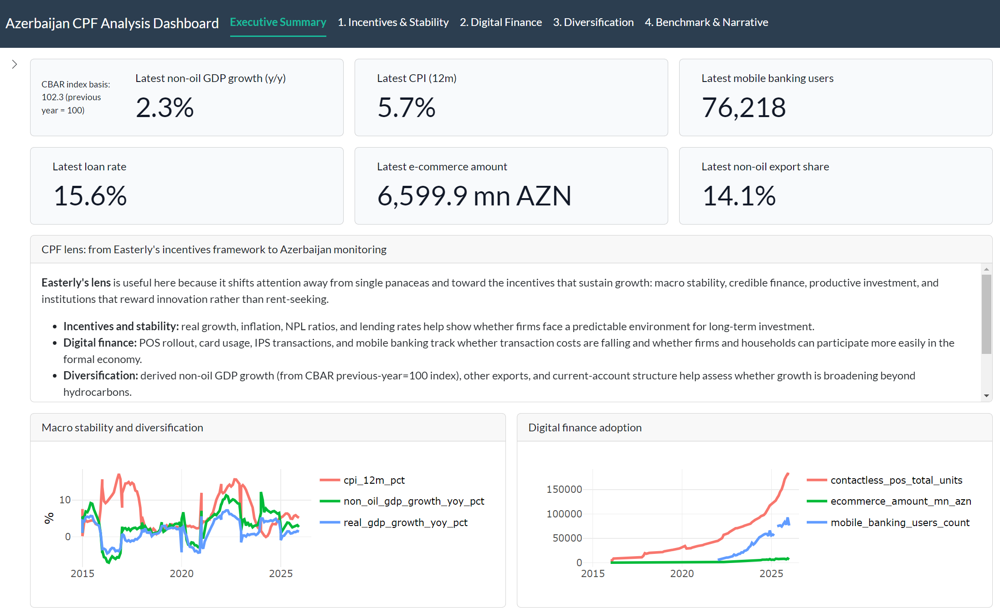

# World Bank Development Statistics Pipeline and Azerbaijan CPF Analysis

Reproducible ETL pipelines for public development indicators, governance, financial access, trade statistics, climate-related external data, price-level proxies, and Azerbaijan-focused macro-financial monitoring, with validation, BigQuery loading, and analysis-ready outputs.

## Overview
This repository builds development-data pipelines that:

- extract public international data from source-oriented datasets, bulk files, APIs, web scraping, XML feeds, and official web publications  
  (e.g., [Central Bank of the Republic of Azerbaijan](https://www.cbar.az/home?language=en), [UNICEF](https://data.unicef.org/resources/un-inter-agency-group-for-child-mortality-estimation-unigme/), [IMF](https://www.imf.org/en/home), [UN Comtrade](https://comtradeplus.un.org/))
- transform raw inputs into curated analytical tables using **Bronze / Silver / Gold** architecture
- validate structural and data-quality conditions
- load outputs into BigQuery
- support downstream cross-country, city-level, and country-specific analysis
- support [Azerbaijan CPF](https://openknowledge.worldbank.org/entities/publication/a7c9d0a2-ef37-4089-872a-4c66d5659516)-focused analytical and simplified banking decision-support demos

---
The Azerbaijan CPF dashboard indicator set was partly informed by [William Easterly’s The Elusive Quest for Growth](https://en.wikipedia.org/wiki/The_Elusive_Quest_for_Growth), particularly its focus on incentives, macroeconomic stability, and institutions as foundations for durable growth.
> Sample R shiny dashboard image

<p align="center">
  
</p>

---

## Azerbaijan central bank and official-statistics layer

The Azerbaijan-focused component is intentionally positioned as the **first country-specific layer** in this repository because it demonstrates an end-to-end **Bronze / Silver / Gold** architecture built from official public sources.

This layer combines:
- CBAR FX data
- SSC monthly macro pages
- CBAR Statistical Bulletin workbook tables
- CBAR policy corridor / refinancing-rate information
- integrated Gold marts for macro-financial and development-oriented interpretation

It is designed not only as a data-engineering example, but also as an analytical foundation for:
- CPF-style country interpretation
- digital-finance progress monitoring
- credit-access and MSME finance analysis
- financial-stability analysis
- external-sector and diversification monitoring
- simplified banking decision-support demos

### Data engineering design

#### Bronze
Source-faithful raw landing tables.

Current Azerbaijan Bronze inputs include:
- CBAR FX daily raw snapshots from the public XML feed
- SSC monthly macro pages parsed from public HTML pages
- CBAR Statistical Bulletin workbooks manually landed in raw folders and parsed into raw bulletin tables
- policy-rate event raw tables from CBAR policy publications

#### Silver
Cleaned and standardized analytical tables at monthly or periodic grain.

Current Azerbaijan Silver outputs include:

##### Existing core monitoring tables
- `aze_fx_monthly`
- `aze_macro_monthly`
- `aze_banking_monthly`
- `aze_policy_rate_monthly`

**Access to finance / credit structure**
- `aze_business_portfolio_periodic` ← Table 5.7 (CBAR Report)
- `aze_sectoral_loans_periodic` ← Table 2.8
- `aze_npl_structure_periodic` ← Table 5.6
- `aze_interest_rates_periodic` ← Table 3.2
- `aze_movable_property_registry_periodic` ← Table 8

**Digital finance / payments**
- `aze_national_payment_systems_periodic` ← Table 4.1
- `aze_payment_service_monthly` ← Table 4.3
- `aze_card_transactions_monthly` ← Table 4.5
- `aze_customer_accounts_ebanking_monthly` ← Table 4.7

**Economic diversification / external sector**
- `aze_macro_main_periodic` ← Table 1.1
- `aze_balance_of_payments_periodic` ← Table 1.4
- `aze_foreign_trade_periodic` ← Table 1.5

#### Gold
Integrated country-level marts for dashboarding, notebooks, and analytical interpretation.

Current Azerbaijan Gold outputs include:

##### Existing Gold table
- `aze_bank_ops_monthly`

##### Newly added Gold marts
- `aze_credit_access_and_stability_periodic`
- `aze_digital_finance_periodic`
- `aze_economic_diversification_periodic`

---

## Azerbaijan analytical themes covered by the bulletin layer

The newly added bulletin tables are organized into three business-facing Gold marts.

### 1) Credit access and financial stability
This mart supports analysis of:
- MSME and entrepreneurial-subject financing
- sectoral allocation of lending
- average interest-rate conditions
- non-performing loan structure
- movable-collateral registry usage as a proxy for secured-finance infrastructure

Source bulletin tables:
- **Table 5.7** Information about the breakdown of the business portfolio on entrepreneurial subjects
- **Table 2.8** Sectoral breakdown of loans
- **Table 5.6** Information on the structure of non-performing loans of banks
- **Table 3.2** Average interest rates on time deposits and loans
- **Table 8** Statistics of encumbrances recorded in the Registry about movable property

Gold output:
- `worldbank01.external_dev_stats.aze_credit_access_and_stability_periodic`

### 2) Digital finance and payments infrastructure
This mart supports analysis of:
- national payment-system usage
- ATM / POS / contactless terminal penetration
- card transaction adoption
- internet and mobile banking adoption

Source bulletin tables:
- **Table 4.1** Transactions through National Payment Systems
- **Table 4.3** Statistics on the payment service network belonging to the statistical unit
- **Table 4.5** Transactions with debit and credit cards
- **Table 4.7** Structure of customers` bank accounts and electronic banking

Gold output:
- `worldbank01.external_dev_stats.aze_digital_finance_periodic`

### 3) Economic diversification and external-sector monitoring
This mart supports analysis of:
- non-oil growth and macro performance
- external balances
- oil / gas versus non-oil external-sector structure
- trade diversification and external integration

Source bulletin tables:
- **Table 1.1** Main macroeconomic indicators
- **Table 1.4** Balance of payments of the Republic of Azerbaijan
- **Table 1.5** Foreign trade of the Republic of Azerbaijan

Gold output:
- `worldbank01.external_dev_stats.aze_economic_diversification_periodic`

---

## Official source URLs

### Central Bank of the Republic of Azerbaijan (CBAR)
- FX rates page: `https://www.cbar.az/currency/rates?language=en`
- Statistical Bulletin page: `https://cbar.az/pages/publications-researches/statistic-bulletin/`
- Example policy press release: `https://www.cbar.az/press-release-5417/central-bank-cuts-refinancing-rate-and-other-interest-rate-corridor-parameters-by-025-pp?language=en`

### State Statistical Committee of Azerbaijan (SSC)
- Monthly macroeconomic indicators page: `https://www.stat.gov.az/news/macroeconomy.php?lang=en&page=1`

---

## Azerbaijan source-to-table mapping

| Source | Access mode | Bronze | Silver | Gold usage |
|---|---|---|---|---|
| CBAR FX XML feed | API / XML | `aze_fx_daily_raw` | `aze_fx_monthly` | FX block in `aze_bank_ops_monthly` |
| SSC monthly macro pages | Web scraping / HTML parsing | `aze_macro_monthly_raw` | `aze_macro_monthly` | CPI, reserves, banking proxies |
| CBAR Statistical Bulletin Table 5.2 | Raw workbook landing + parsing | `aze_banking_monthly_raw` | `aze_banking_monthly` | total assets, loans, deposits |
| CBAR Statistical Bulletin Table 3.1 and policy publications | Raw workbook landing + parsing / web policy sources | `aze_policy_rate_events_raw` | `aze_policy_rate_monthly` | corridor floor, refinancing rate, corridor ceiling |
| CBAR Statistical Bulletin Table 5.7 | Raw workbook landing + parsing | `aze_business_portfolio_periodic_raw` | `aze_business_portfolio_periodic` | credit access and MSME finance mart |
| CBAR Statistical Bulletin Table 2.8 | Raw workbook landing + parsing | `aze_sectoral_loans_periodic_raw` | `aze_sectoral_loans_periodic` | sectoral lending block |
| CBAR Statistical Bulletin Table 5.6 | Raw workbook landing + parsing | `aze_npl_structure_periodic_raw` | `aze_npl_structure_periodic` | asset-quality / stability block |
| CBAR Statistical Bulletin Table 3.2 | Raw workbook landing + parsing | `aze_interest_rates_periodic_raw` | `aze_interest_rates_periodic` | lending / deposit rate block |
| CBAR Statistical Bulletin Table 8 | Raw workbook landing + parsing | `aze_movable_property_registry_periodic_raw` | `aze_movable_property_registry_periodic` | collateral-registry block |
| CBAR Statistical Bulletin Table 4.1 | Raw workbook landing + parsing | `aze_national_payment_systems_periodic_raw` | `aze_national_payment_systems_periodic` | digital-finance mart |
| CBAR Statistical Bulletin Table 4.3 | Raw workbook landing + parsing | `aze_payment_service_monthly_raw` | `aze_payment_service_monthly` | ATM / POS / contactless block |
| CBAR Statistical Bulletin Table 4.5 | Raw workbook landing + parsing | `aze_card_transactions_monthly_raw` | `aze_card_transactions_monthly` | debit / credit card block |
| CBAR Statistical Bulletin Table 4.7 | Raw workbook landing + parsing | `aze_customer_accounts_ebanking_monthly_raw` | `aze_customer_accounts_ebanking_monthly` | internet / mobile banking block |
| CBAR Statistical Bulletin Table 1.1 | Raw workbook landing + parsing | `aze_macro_main_periodic_raw` | `aze_macro_main_periodic` | diversification mart |
| CBAR Statistical Bulletin Table 1.4 | Raw workbook landing + parsing | `aze_balance_of_payments_periodic_raw` | `aze_balance_of_payments_periodic` | external-balance block |
| CBAR Statistical Bulletin Table 1.5 | Raw workbook landing + parsing | `aze_foreign_trade_periodic_raw` | `aze_foreign_trade_periodic` | trade structure block |

---

## Why this matters analytically
This Azerbaijan layer shows how official central-bank and statistical-agency publications can be transformed into analytical marts that support:

- macro-financial monitoring
- digital-finance and payments analysis
- credit-access and MSME-finance interpretation
- financial-stability analysis
- diversification and non-oil growth assessment
- simplified decision-support demos aligned with World Bank CPF-style narratives

---

## Why this repository
This project is designed to demonstrate:

- source-oriented data extraction
- reproducible ETL design
- explicit data-lineage awareness
- country-year, city-year, and month-level data modeling
- validation before loading
- cloud-ready analytical storage in BigQuery
- the ability to transform source statistical inputs into curated analytical assets
- CPF-informed country analysis
- simplified macro-to-banking decision-support design

A central design principle is to distinguish between:
- **official API-based World Bank indicators**
- **World Bank-managed bulk datasets**
- **external public datasets used as complementary analytical inputs**
- **country-specific layered marts built for operational interpretation**

To reflect this, BigQuery tables are organized into:
- `worldbank01.wb_dev_stats`
- `worldbank01.external_dev_stats`
- `worldbank01.external_dev_stats_bronze`
- `worldbank01.external_dev_stats_silver`

---

## BigQuery datasets

### 1) World Bank / World Bank-managed dataset
Dataset:
- `worldbank01.wb_dev_stats`

This dataset contains indicators retrieved directly from the World Bank API and other World Bank-managed source datasets.

### 2) External source-oriented Gold dataset
Dataset:
- `worldbank01.external_dev_stats`

This dataset contains:
- external public-source analytical Gold tables
- Azerbaijan Gold marts
- bulletin-derived integrated country monitoring outputs

Current Azerbaijan Gold tables include:
- `aze_bank_ops_monthly`
- `aze_credit_access_and_stability_periodic`
- `aze_digital_finance_periodic`
- `aze_economic_diversification_periodic`

### 3) Azerbaijan Bronze dataset
Dataset:
- `worldbank01.external_dev_stats_bronze`

This dataset contains source-faithful raw landing tables for Azerbaijan external-source pipelines, including raw bulletin extractions.

### 4) Azerbaijan Silver dataset
Dataset:
- `worldbank01.external_dev_stats_silver`

This dataset contains cleaned and standardized Azerbaijan intermediate tables at monthly / quarterly / yearly analytical grain before Gold-level integration.

---

## Current implemented pipelines

### Azerbaijan-focused macro-financial and bulletin monitoring layer
- CBAR FX daily raw ingestion and monthly aggregation
- SSC monthly macro indicators
- Azerbaijan banking-sector monthly indicators from CBAR Statistical Bulletin Table 5.2
- Azerbaijan policy corridor / refinancing-rate monthly series from CBAR Statistical Bulletin Table 3.1 and policy publications
- Azerbaijan business portfolio / MSME finance pipeline from CBAR Table 5.7
- Azerbaijan sectoral loans pipeline from CBAR Table 2.8
- Azerbaijan NPL structure pipeline from CBAR Table 5.6
- Azerbaijan interest-rate pipeline from CBAR Table 3.2
- Azerbaijan movable-property registry pipeline from CBAR Table 8
- Azerbaijan national payment systems pipeline from CBAR Table 4.1
- Azerbaijan payment service network pipeline from CBAR Table 4.3
- Azerbaijan card transactions pipeline from CBAR Table 4.5
- Azerbaijan customer accounts and e-banking pipeline from CBAR Table 4.7
- Azerbaijan main macroeconomic indicators pipeline from CBAR Table 1.1
- Azerbaijan balance of payments pipeline from CBAR Table 1.4
- Azerbaijan foreign trade pipeline from CBAR Table 1.5
- Integrated Azerbaijan bank-operations monthly mart
- Integrated Azerbaijan credit-access and stability mart
- Integrated Azerbaijan digital-finance mart
- Integrated Azerbaijan economic-diversification mart

### World Bank API-based indicators
- Girls’ primary completion rate
- GDP per capita
- Net ODA received per capita
- Learning-adjusted years of schooling (LAYS)

### World Bank-managed datasets
- Worldwide Governance Indicators (WGI)
- Global Findex

### External source-oriented datasets
- Under-five mortality (U5MR) from UN-IGME
- Financial Access Survey (FAS) from IMF
- Merchandise trade flows from UN Comtrade
- City temperature time series from Open-Meteo
- Big Mac Index from The Economist

---

## 1) U5MR pipeline
The U5MR workflow uses the **UN-IGME observational database** as the upstream source, rather than relying only on downstream redistribution through World Bank Open Data.

This reflects an explicit **data lineage** choice:
- use the original source-side dataset
- treat it as the **source-of-truth raw input**
- transform it into an analysis-ready annual country-year table

### U5MR transformations
- filter to included observations
- convert irregular observation dates into annual records
- aggregate multiple observations within the same year
- standardize to **one row per country per year**
- fill missing internal years using **linear interpolation**
- flag interpolated years using `is_interpolated`

### Linear interpolation
### Note on missing data
The WDI documentation notes that development data may contain missing values and may not always be fully comparable across countries and years, and that multiple aggregation methods are used depending on the indicator. In this project, I use a simple **linear interpolation** method for demonstration purposes rather than attempting to reproduce the official aggregation rules. [WDI Sources and Methods](https://datatopics.worldbank.org/world-development-indicators/sources-and-methods.html).

If a value is observed at year `x0` and another value is observed at year `x1`, then the interpolated value at year `x` is:

`y(x) = y0 + ((x - x0) / (x1 - x0)) * (y1 - y0)`

where:

- `x0`: earlier observed year
- `x1`: later observed year
- `y0`: observed value at `x0`
- `y1`: observed value at `x1`

This produces a continuous annual trend between observed points.

### BigQuery table
Dataset:
- `external_dev_stats`

Table:
- `worldbank01.external_dev_stats.u5mr_country_year`

### Main columns
- `country_name`
- `country_iso`
- `year`
- `u5mr_estimate`
- `standard_error_of_estimates`
- `is_interpolated`

---

## 2) Girls’ primary completion pipeline
This workflow retrieves:

- **Primary completion rate, female (% of relevant age group)**
- Indicator code: `SE.PRM.CMPT.FE.ZS`

### Source
- World Bank API

### Outputs
Two tables are created:

#### Country-year table
- full country-year time series
- useful for trend analysis and panel joins

#### Latest country snapshot
- most recent non-null value for each country
- useful for cross-country comparison and ranking

### BigQuery tables
Dataset:
- `wb_dev_stats`

Tables:
- `worldbank01.wb_dev_stats.girls_primary_completion_country_year`
- `worldbank01.wb_dev_stats.girls_primary_completion_country_latest`

---

## 3) GDP per capita pipeline
This workflow retrieves:

- **GDP per capita (current US$)**
- Indicator code: `NY.GDP.PCAP.CD`

### Source
- World Bank API

### Outputs
Two tables are created:

#### Country-year table
- full country-year time series
- useful for panel analysis and joins with education, health, aid, trade, governance, and financial access indicators

#### Latest country snapshot
- most recent non-null value for each country
- useful for cross-country comparison

### BigQuery tables
Dataset:
- `wb_dev_stats`

Tables:
- `worldbank01.wb_dev_stats.gdp_per_capita_country_year`
- `worldbank01.wb_dev_stats.gdp_per_capita_country_latest`

---

## 4) Net ODA received per capita pipeline
This workflow retrieves:

- **Net ODA received per capita (current US$)**
- Indicator code: `DT.ODA.ODAT.PC.ZS`

### Source
- World Bank API

### Outputs
Two tables are created:

#### Country-year table
- full country-year time series
- useful for aid and development trajectory analysis

#### Latest country snapshot
- most recent non-null value for each country

### BigQuery tables
Dataset:
- `wb_dev_stats`

Tables:
- `worldbank01.wb_dev_stats.oda_received_per_capita_country_year`
- `worldbank01.wb_dev_stats.oda_received_per_capita_country_latest`

---

## 5) LAYS pipeline
This workflow retrieves:

- **Learning-adjusted years of schooling**
- Indicator code: `HD.HCI.LAYS`

### Source
- World Bank API

### Why this indicator matters
LAYS is designed to go beyond years of schooling alone by incorporating learning quality into a schooling-based measure.
This makes it especially useful when comparing educational attainment in a more development-relevant way.

### Outputs
Two tables are created:

#### Country-year table
- full country-year time series

#### Latest country snapshot
- most recent non-null value for each country

### BigQuery tables
Dataset:
- `wb_dev_stats`

Tables:
- `worldbank01.wb_dev_stats.lays_country_year`
- `worldbank01.wb_dev_stats.lays_country_latest`

---

## 6) WGI pipeline
This workflow uses the **Worldwide Governance Indicators (WGI)** as a World Bank-managed governance dataset covering six core dimensions of institutional quality.

### Source
- World Bank WGI bulk file

### Current governance dimensions included
- Voice and Accountability
- Political Stability and Absence of Violence/Terrorism
- Government Effectiveness
- Regulatory Quality
- Rule of Law
- Control of Corruption

### Transformations
The current WGI input file is structured as:
- one row per economy × governance dimension × year

The workflow:
- reads the official WGI Excel bulk file
- standardizes identifiers
- maps governance dimension codes
- pivots dimension rows into a single country-year analytical table
- loads curated outputs into BigQuery

### Outputs
Two tables are created:

#### Country-year table
- full country-year time series
- useful for panel analysis and joins with GDP, U5MR, trade, and financial access indicators

#### Latest country snapshot
- most recent non-null value for each country
- useful for cross-country institutional comparison

### BigQuery tables
Dataset:
- `wb_dev_stats`

Tables:
- `worldbank01.wb_dev_stats.wgi_country_year`
- `worldbank01.wb_dev_stats.wgi_country_latest`

### Main columns
- `country_name`
- `country_iso`
- `year`
- `voice_accountability`
- `political_stability`
- `government_effectiveness`
- `regulatory_quality`
- `rule_of_law`
- `control_of_corruption`
- `source_name`
- `load_timestamp`

---

## 7) Global Findex pipeline
This workflow uses the **World Bank Global Findex** country-level dataset as a complementary source for financial inclusion analysis.

### Source
- World Bank Global Findex

### Why this matters analytically
Global Findex provides demand-side indicators on account ownership, financial access, digital payments, mobile money, and related financial inclusion outcomes.
In this repository it is treated as a complementary dataset that can be joined with:
- GDP per capita
- U5MR
- girls’ primary completion
- LAYS
- WGI
- trade indicators

### Important note on missing values
Indicator coverage varies across countries and survey waves.
Nulls are retained as source-faithful missing values rather than being imputed.

### Outputs
Two tables are created:

#### Country-year table
- historical country-year data
- useful for panel analysis and joins with macro and development indicators

#### Latest country snapshot
- most recent non-null record for each country
- useful for cross-country comparison

### BigQuery tables
Dataset:
- `external_dev_stats`

Tables:
- `worldbank01.external_dev_stats.global_findex_country_year`
- `worldbank01.external_dev_stats.global_findex_country_latest`

### Main columns
- `country_name`
- `country_iso`
- `year`
- `account_ownership_pct`
- `financial_institution_account_pct`
- `mobile_money_account_pct`
- `digital_payment_pct`
- `borrowed_from_financial_institution_pct`
- `source_name`
- `load_timestamp`

---

## 8) IMF FAS pipeline
This workflow uses the **IMF Financial Access Survey (FAS)** as a complementary source for supply-side and institutional financial access statistics.

### Source
- IMF Financial Access Survey (FAS)

### Current curated subset
The current implementation keeps a small curated subset of annual series from the FAS bulk file, including:
- number of commercial banks
- borrowers from commercial banks
- active mobile money accounts

### Transformations
The current FAS input file is structured as:
- one row per country × series
- annual values stored in year columns

The workflow:
- reads the IMF FAS bulk CSV
- extracts ISO3 from `SERIES_CODE`
- maps selected FAS series into curated analytical variables
- melts year columns into a long structure
- pivots into a one-row-per-country-per-year analytical table
- loads curated outputs into BigQuery

### Outputs
Two tables are created:

#### Country-year table
- historical country-year data
- useful for joins with GDP, governance, education, and financial inclusion indicators

#### Latest country snapshot
- most recent non-null record for each country
- useful for cross-country comparison

### BigQuery tables
Dataset:
- `external_dev_stats`

Tables:
- `worldbank01.external_dev_stats.imf_fas_country_year`
- `worldbank01.external_dev_stats.imf_fas_country_latest`

### Main columns
- `country_name`
- `country_iso`
- `year`
- `commercial_banks_number`
- `borrowers_commercial_banks_number`
- `active_mobile_money_accounts_number`
- `source_name`
- `load_timestamp`

---

## 9) Trade pipeline
This repository also includes a trade-data workflow built from **UN Comtrade**, chosen as a more source-oriented and raw-data-near input for international merchandise trade analysis.

### Why UN Comtrade
UN Comtrade is treated here as a primary-data-near trade source for internationally reported merchandise trade flows.

### Current trade scope
The current implementation focuses on a curated set of country-product-flow combinations used for development-oriented analysis and Azerbaijan/Kazakhstan-focused extensions.

### Why this matters analytically
This trade pipeline can be joined with other development indicators in the repository, such as:
- U5MR
- girls’ primary completion
- GDP per capita
- Net ODA received per capita
- LAYS
- WGI
- Global Findex
- IMF FAS

### BigQuery tables
Dataset:
- `external_dev_stats`

Tables:
- `worldbank01.external_dev_stats.trade_country_year_long`
- `worldbank01.external_dev_stats.trade_country_latest`

---

## 10) City temperature pipeline
This workflow retrieves historical daily temperature data from **Open-Meteo** for a selected group of major world cities and converts them into annual city-level averages.

### Source
- Open-Meteo Historical Weather API

### BigQuery table
Dataset:
- `external_dev_stats`

Table:
- `worldbank01.external_dev_stats.city_temperature_annual`

---

## 11) Big Mac Index pipeline
This workflow uses the **Big Mac Index** as a supplementary external proxy for price levels, purchasing power, and relative currency valuation.

### Source
- The Economist Big Mac Index

### Why this matters analytically
The Big Mac Index is not an official World Bank indicator.
In this repository it is treated as a complementary external source for comparative price-level and purchasing-power context.

This makes it possible to compare:
- income levels and relative prices
- purchasing-power proxy and education / health indicators
- trade structure and price-level context

### Outputs
Two tables are created:

#### Country-period table
- historical country-period data

#### Latest country snapshot
- most recent non-null record for each country

### BigQuery tables
Dataset:
- `external_dev_stats`

Tables:
- `worldbank01.external_dev_stats.big_mac_index_country_period`
- `worldbank01.external_dev_stats.big_mac_index_country_latest`

### Main columns
- `country_name`
- `country_iso`
- `date`
- `year`
- `currency_code`
- `local_price`
- `dollar_price`
- `usd_raw_index`
- `usd_adjusted_index`
- `gdp_dollar`
- `source_name`
- `load_timestamp`

---

## 12) Azerbaijan bank-operations and bulletin monitoring layer

This repository includes an Azerbaijan-focused macro-financial monitoring layer designed as a **simplified decision-support demo** rather than a replication of back-office banking procedures.

The purpose is to show how CPF-relevant macro, trade, governance, and financial-access signals can be translated into practical banking and financial-sector monitoring logic.

### Analytical intent
This layer is designed to support:
- macro-to-banking signal design
- FX pressure monitoring
- liquidity and funding interpretation
- lending stance interpretation
- CPF-informed financial-sector discussion
- dashboard-ready monthly and periodic monitoring

### Layering design
The Azerbaijan bank-operations and bulletin component follows a Bronze / Silver / Gold structure.

#### Bronze
Source-faithful raw landing tables.

#### Silver
Cleaned and standardized monthly and periodic analytical tables.

#### Gold
Integrated marts for notebook and dashboard use.

---

## 12.1) Azerbaijan FX ingestion

### Source
- CBAR exchange-rate XML feed: `https://www.cbar.az/currency/rates?language=en`

### Design
- daily raw FX snapshots are ingested dynamically from the official CBAR XML feed
- raw observations are accumulated in a daily raw table
- monthly FX tables are derived from the latest available daily observation in each month
- historical backfill can be performed by iterating over date-addressable CBAR XML files

### Current tables
#### Legacy external dataset
- `worldbank01.external_dev_stats.aze_fx_daily_raw`
- `worldbank01.external_dev_stats.aze_fx_monthly`

### Main columns
#### `aze_fx_daily_raw`
- `as_of_date`
- `currency_name`
- `currency_code`
- `nominal`
- `rate_azn`
- `rate_azn_per_unit`

#### `aze_fx_monthly`
- `month`
- `usd_azn`
- `eur_azn`
- `gbp_azn`
- `rub_azn`
- `try_azn`
- `kzt_azn`
- `gel_azn`
- `cny_azn`

### Important note
The FX layer supports dynamic ingestion and historical backfill. It remains in the legacy external dataset for now and may be migrated into the layered Bronze/Silver structure in a later cleanup step.

---

## 12.2) Azerbaijan macro monthly pipeline

### Source
- SSC monthly macroeconomic indicators page: `https://www.stat.gov.az/news/macroeconomy.php?lang=en&page=1`

### Bronze
- `worldbank01.external_dev_stats_bronze.aze_macro_monthly_raw`

### Silver
- `worldbank01.external_dev_stats_silver.aze_macro_monthly`

### Current variables
- `cpi_yoy`
- `official_fx_reserves_usd_mn`
- `bank_loans_customers_mn_azn` (SSC macro page proxy)
- `bank_deposits_total_mn_azn` (SSC macro page proxy)

### Design
This layer is built from SSC monthly macro pages parsed through public web scraping / HTML table parsing and is intended to remove dependency on placeholder CSV-based monthly macro inputs.

---

## 12.3) Azerbaijan banking monthly pipeline

### Source
- CBAR Statistical Bulletin page: `https://cbar.az/pages/publications-researches/statistic-bulletin/`
- Table 5.2 Overview of Banking Sector from monthly bulletin workbooks

### Bronze
- `worldbank01.external_dev_stats_bronze.aze_banking_monthly_raw`

### Silver
- `worldbank01.external_dev_stats_silver.aze_banking_monthly`

### Current variables
- `bank_total_assets_mn_azn`
- `bank_loans_customers_mn_azn`
- `bank_deposits_total_mn_azn`

### Raw landing convention
The current implementation assumes bulletin workbooks are manually placed in:

```text
data/raw/aze_banking_bulletins_xlsx/
```

with filenames like:

```text
statistical_bulletin_2024_03.xlsx
statistical_bulletin_2024_06.xlsx
statistical_bulletin_2024_09.xlsx
```

### Dedup rule
If the same analytical month appears in multiple bulletin files, the row from the latest `bulletin_period` is retained.

---

## 12.4) Azerbaijan policy-rate monthly pipeline

### Source
- CBAR Statistical Bulletin page: `https://cbar.az/pages/publications-researches/statistic-bulletin/`
- Table 3.1 from bulletin workbooks
- latest policy press release page for manual reference: `https://www.cbar.az/press-release-5417/central-bank-cuts-refinancing-rate-and-other-interest-rate-corridor-parameters-by-025-pp?language=en`

### Bronze
- `worldbank01.external_dev_stats_bronze.aze_policy_rate_events_raw`

### Silver
- `worldbank01.external_dev_stats_silver.aze_policy_rate_monthly`

### Current variables
- `refinancing_rate`
- `corridor_floor`
- `corridor_ceiling`

### Design
This layer is built from CBAR bulletin workbooks parsed from Table 3.1 and standardized into monthly policy corridor series.

---

## 12.5) Azerbaijan bulletin-based additional Silver pipelines

### Access to finance / financial stability
- `worldbank01.external_dev_stats_silver.aze_business_portfolio_periodic`
- `worldbank01.external_dev_stats_silver.aze_sectoral_loans_periodic`
- `worldbank01.external_dev_stats_silver.aze_npl_structure_periodic`
- `worldbank01.external_dev_stats_silver.aze_interest_rates_periodic`
- `worldbank01.external_dev_stats_silver.aze_movable_property_registry_periodic`

### Digital finance
- `worldbank01.external_dev_stats_silver.aze_national_payment_systems_periodic`
- `worldbank01.external_dev_stats_silver.aze_payment_service_monthly`
- `worldbank01.external_dev_stats_silver.aze_card_transactions_monthly`
- `worldbank01.external_dev_stats_silver.aze_customer_accounts_ebanking_monthly`

### Economic diversification / external sector
- `worldbank01.external_dev_stats_silver.aze_macro_main_periodic`
- `worldbank01.external_dev_stats_silver.aze_balance_of_payments_periodic`
- `worldbank01.external_dev_stats_silver.aze_foreign_trade_periodic`

### Design notes
These tables are parsed from CBAR Statistical Bulletin workbook layouts that may mix:
- year rows with month rows beneath them
- yearly and quarterly structures
- table-specific row-label conventions

To support these parsers, shared helper logic is centralized in:
- `src/extract_aze_bulletin_common.py`

This helper is used for:
- bulletin filename date parsing
- sheet matching
- year / month / quarter reconstruction
- row-label normalization
- safe periodic merges
- deduplication helpers

---

## 12.6) Azerbaijan Gold marts

### Gold tables
- `worldbank01.external_dev_stats.aze_bank_ops_monthly`
- `worldbank01.external_dev_stats.aze_credit_access_and_stability_periodic`
- `worldbank01.external_dev_stats.aze_digital_finance_periodic`
- `worldbank01.external_dev_stats.aze_economic_diversification_periodic`

### Purpose
These tables are designed as integrated marts for:
- notebook-based signal engineering
- dashboard development
- Azerbaijan CPF-informed macro-financial interpretation
- digital-finance progress tracking
- credit-access and financial-stability interpretation
- diversification and external-sector analysis
- simplified banking decision-support demonstration

### Important note
These marts are intended as decision-support demos. They do **not** attempt to replicate bank back-office procedures. Instead, they translate macro, policy, FX, banking, payment, lending, and external-sector indicators into monitoring-oriented analytical layers.

---

## Validation vs testing

### Validation
Validation checks the **current transformed dataset** before loading.

Examples:
- missing required columns
- null country or year identifiers
- duplicate country-year or month rows
- null-heavy value columns
- unusual year or date ranges

Validation returns:
- **errors** → stop the pipeline
- **warnings** → log and continue

### Testing
Testing checks whether the **code logic** behaves as expected.

Examples:
- interpolation behaves correctly
- annualization logic works correctly
- latest-value extraction returns the correct row
- WGI dimension pivoting works correctly
- FAS series-code mapping works correctly
- FX XML parsing and monthly aggregation work correctly
- Azerbaijan bulletin deduplication works correctly
- Azerbaijan Gold mart integration behaves correctly

Tests are implemented with `pytest`.

---

## BigQuery loading
All current loads use:

- `WRITE_TRUNCATE`

except the Azerbaijan FX raw layer, which uses append-oriented accumulation logic prior to monthly aggregation.

---

## Raw data landing

Some workflows read directly from APIs, XML feeds, or public web pages, while others intentionally use manually maintained raw landing files.

### Raw landing folder
```text
data/
└── raw/
```

### Current manually landed raw files
- `data/raw/global_findex_country.csv`
- `data/raw/imf_fas.csv`
- `data/raw/wgi.xlsx`
- `data/raw/aze_banking_bulletins_xlsx/*.xlsx`

### Dynamic raw ingestion currently implemented
- CBAR FX XML feed → `aze_fx_daily_raw`
- SSC macro monthly pages → `aze_macro_monthly_raw`
- CBAR policy bulletin workbooks → `aze_policy_rate_events_raw`

---

## Repository structure
```text
wb_dev_data_pipeline/
├── README.md
├── requirements.txt
├── .gitignore
├── pytest.ini
├── src/
│   ├── __init__.py
│   ├── main_u5mr.py
│   ├── extract_u5mr.py
│   ├── transform_u5mr.py
│   ├── main_girls_primary_completion.py
│   ├── extract_girls_primary_completion.py
│   ├── transform_girls_primary_completion.py
│   ├── main_gdp_per_capita.py
│   ├── extract_gdp_per_capita.py
│   ├── transform_gdp_per_capita.py
│   ├── main_oda_per_capita.py
│   ├── extract_oda_per_capita.py
│   ├── transform_oda_per_capita.py
│   ├── main_lays.py
│   ├── extract_lays.py
│   ├── transform_lays.py
│   ├── main_wgi.py
│   ├── extract_wgi.py
│   ├── transform_wgi.py
│   ├── main_global_findex.py
│   ├── extract_global_findex.py
│   ├── transform_global_findex.py
│   ├── main_imf_fas.py
│   ├── extract_imf_fas.py
│   ├── transform_imf_fas.py
│   ├── main_trade.py
│   ├── extract_trade.py
│   ├── transform_trade.py
│   ├── main_city_temperature.py
│   ├── extract_city_temperature.py
│   ├── transform_city_temperature.py
│   ├── main_big_mac.py
│   ├── extract_big_mac.py
│   ├── transform_big_mac.py
│   ├── extract_aze_fx_rates.py
│   ├── backfill_aze_fx_daily.py
│   ├── extract_aze_ssc_macro_api.py
│   ├── extract_aze_banking_bulletin_xlsx_raw.py
│   ├── extract_aze_policy_bulletin_xlsx_raw.py
│   ├── extract_aze_bulletin_common.py
│   ├── extract_aze_business_portfolio_xlsx_raw.py
│   ├── extract_aze_sectoral_loans_xlsx_raw.py
│   ├── extract_aze_national_payment_systems_xlsx_raw.py
│   ├── extract_aze_payment_service_xlsx_raw.py
│   ├── extract_aze_card_transactions_xlsx_raw.py
│   ├── extract_aze_customer_accounts_ebanking_xlsx_raw.py
│   ├── extract_aze_macro_main_xlsx_raw.py
│   ├── extract_aze_balance_of_payments_xlsx_raw.py
│   ├── extract_aze_foreign_trade_xlsx_raw.py
│   ├── extract_aze_movable_property_registry_xlsx_raw.py
│   ├── extract_aze_npl_structure_xlsx_raw.py
│   ├── extract_aze_interest_rates_xlsx_raw.py
│   ├── transform_aze_bank_ops.py
│   ├── transform_aze_bank_ops_gold.py
│   ├── transform_aze_macro_monthly.py
│   ├── transform_aze_banking_monthly.py
│   ├── transform_aze_policy_rate_monthly.py
│   ├── transform_aze_business_portfolio_periodic.py
│   ├── transform_aze_sectoral_loans_periodic.py
│   ├── transform_aze_national_payment_systems_periodic.py
│   ├── transform_aze_payment_service_monthly.py
│   ├── transform_aze_card_transactions_monthly.py
│   ├── transform_aze_customer_accounts_ebanking_monthly.py
│   ├── transform_aze_macro_main_periodic.py
│   ├── transform_aze_balance_of_payments_periodic.py
│   ├── transform_aze_foreign_trade_periodic.py
│   ├── transform_aze_movable_property_registry_periodic.py
│   ├── transform_aze_npl_structure_periodic.py
│   ├── transform_aze_interest_rates_periodic.py
│   ├── transform_aze_credit_access_and_stability_gold.py
│   ├── transform_aze_digital_finance_gold.py
│   ├── transform_aze_economic_diversification_gold.py
│   ├── main_aze_macro_monthly.py
│   ├── main_aze_banking_monthly.py
│   ├── main_aze_policy_rate_monthly.py
│   ├── main_aze_bank_ops.py
│   ├── main_aze_business_portfolio_periodic.py
│   ├── main_aze_sectoral_loans_periodic.py
│   ├── main_aze_national_payment_systems_periodic.py
│   ├── main_aze_payment_service_monthly.py
│   ├── main_aze_card_transactions_monthly.py
│   ├── main_aze_customer_accounts_ebanking_monthly.py
│   ├── main_aze_macro_main_periodic.py
│   ├── main_aze_balance_of_payments_periodic.py
│   ├── main_aze_foreign_trade_periodic.py
│   ├── main_aze_movable_property_registry_periodic.py
│   ├── main_aze_npl_structure_periodic.py
│   ├── main_aze_interest_rates_periodic.py
│   ├── main_aze_credit_access_and_stability_gold.py
│   ├── main_aze_digital_finance_gold.py
│   ├── main_aze_economic_diversification_gold.py
│   ├── validate.py
│   ├── load_bigquery.py
│   └── config.py
├── tests/
│   ├── __init__.py
│   ├── test_transform_u5mr.py
│   ├── test_transform_girls_primary_completion.py
│   ├── test_transform_gdp_per_capita.py
│   ├── test_transform_lays.py
│   ├── test_transform_wgi.py
│   ├── test_transform_global_findex.py
│   ├── test_transform_imf_fas.py
│   ├── test_transform_trade.py
│   ├── test_transform_city_temperature.py
│   ├── test_transform_big_mac.py
│   └── test_transform_aze_bulletin_extended.py
├── sql/
│   ├── create_dataset.sql
│   ├── create_dataset_aze_layers.sql
│   ├── create_tables_u5mr.sql
│   ├── create_tables_girls_primary_completion.sql
│   ├── create_tables_gdp_per_capita.sql
│   ├── create_tables_oda_per_capita.sql
│   ├── create_tables_lays.sql
│   ├── create_tables_wgi.sql
│   ├── create_tables_global_findex.sql
│   ├── create_tables_imf_fas.sql
│   ├── create_tables_trade.sql
│   ├── create_tables_city_temperature.sql
│   ├── create_tables_big_mac.sql
│   ├── create_tables_aze_macro_bronze_silver.sql
│   ├── create_tables_aze_banking_bronze_silver.sql
│   ├── create_tables_aze_policy_bronze_silver.sql
│   ├── create_tables_aze_fx_daily_raw.sql
│   ├── create_tables_aze_fx_monthly.sql
│   ├── create_tables_aze_bank_ops.sql
│   ├── create_aze_bulletin_all_tables.sql
│   └── sample_queries.sql
├── data/
│   └── raw/
├── outputs/
│   ├── charts/
│   └── tables/
└── .github/
    └── workflows/
        └── ci.yml
```

---

## Suggested analytical use cases

This repository supports:
- cross-country development indicator analysis
- governance and financial-access comparison
- price-level and purchasing-power comparison
- Azerbaijan CPF-informed country analysis
- macro-to-banking signal design
- simplified monthly and periodic financial-sector monitoring marts
- dashboard-ready operational decision-support layers
- digital-finance progress tracking
- MSME finance and sectoral credit interpretation
- external-balance and diversification monitoring

---

## Current limitations
- Some Azerbaijan source pages and bulletin workbooks are scraped from public HTML or XLSX publications and may require parser adjustments if the publication layout changes.
- The Azerbaijan bank-operations component is a simplified monitoring and decision-support demo, not a replication of internal banking procedures.
- Some bulletin tables mix yearly, quarterly, and monthly structures, so parser maintenance may be needed when the workbook layout changes.
- Gold marts depend on prior Silver-table creation and consistent `period_date` / `period_type` normalization.
